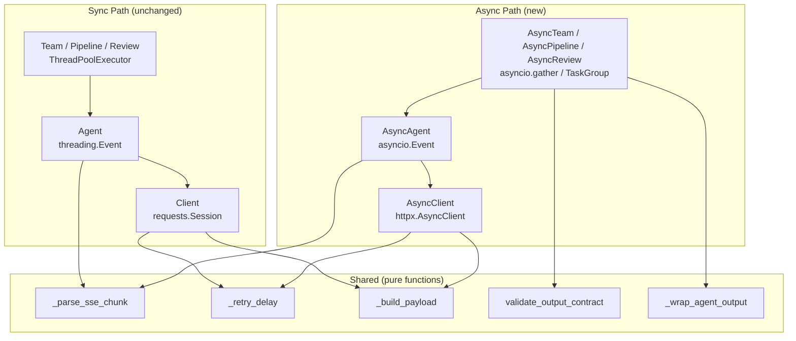

# Design: Async Support

**Status:** Proposal
**Author:** Pantheon review backlog (Athena + Eris)
**Date:** 2026-03-29
**Phase:** 6A

## Problem

The Pantheon runtime is fully synchronous. Every layer — HTTP transport, agent
ReAct loop, multi-agent orchestration — blocks on OS threads.

| Layer | Current | Bottleneck |
|-------|---------|------------|
| `gateway.py` | `requests.Session` | One blocked thread per HTTP request |
| `agent.py` | Sync ReAct loop, `threading.Event` cancellation | Sequential tool calls block the caller |
| `orchestrate.py` | `ThreadPoolExecutor` + `as_completed` | Thread-per-agent fan-out |
| `rate_limit.py` | `time.sleep()`, file-based directory lock | Blocks event loop if called from async |

Thread-based parallelism works but limits scalability. A `Review` with 5 agents
spawns 5 OS threads, each blocking on HTTP I/O. Under orchestration patterns
like `/rally` (7+ specialists), thread contention and memory overhead become
non-trivial. At 50 concurrent agents, the thread pool becomes the bottleneck.

## Constraints

- **Python >=3.10** is the current floor (`pyproject.toml:9`)
- `asyncio.TaskGroup` and `asyncio.timeout` require **Python 3.11+**
- `ExceptionGroup` (raised by `TaskGroup`) requires **3.11+** and `except*` syntax
- Existing sync API must remain unchanged — zero breaking changes
- `httpx` must be optional (not all users need async)
- Tools are inherently synchronous (subprocess, file I/O) — they cannot be made async

## Proposed Design

### Principle: Parallel Path, Not Replacement

Keep every existing sync class. Add async variants alongside them. Users who
never `import asyncio` see no change.

```
gateway.py:   Client (sync, unchanged)  +  AsyncClient (new)
agent.py:     Agent  (sync, unchanged)  +  AsyncAgent  (new)
orchestrate:  Team / Pipeline / Review   +  AsyncTeam / AsyncPipeline / AsyncReview
```

### Component Map



### Layer 1: Gateway — `AsyncClient`

**File:** `gateway.py`

Keep `Client` exactly as-is. Add `AsyncClient` using `httpx.AsyncClient`:

```python
import httpx

class AsyncClient:
    """Async OpenAI-compatible gateway client."""

    def __init__(self, base_url: str, api_key: str, timeout: int = 300) -> None:
        if not api_key:
            raise ValueError("API key is required. ...")
        self.base_url = base_url.rstrip("/")
        self._api_key = api_key
        self.timeout = timeout
        self._client = httpx.AsyncClient(
            base_url=self.base_url,
            timeout=httpx.Timeout(float(timeout)),
            limits=httpx.Limits(
                max_connections=20,
                max_keepalive_connections=10,
            ),
            headers={
                "Content-Type": "application/json",
                "Authorization": f"Bearer {api_key}",
            },
        )

    async def close(self) -> None:
        await self._client.aclose()

    async def __aenter__(self) -> AsyncClient:
        return self

    async def __aexit__(self, *exc: object) -> None:
        await self.close()

    async def chat(self, *, model, messages, **kw) -> ChatResponse:
        payload = _build_payload(model, messages, **kw)  # shared pure function
        for attempt in range(_MAX_RETRIES):
            await _acquire_rate_limit_async(self.base_url, self._api_key)
            resp = await self._client.post(
                "/chat/completions", json=payload, timeout=self.timeout,
            )
            if resp.status_code == 200:
                return _parse_response(resp.json())
            if resp.status_code not in _RETRYABLE_STATUS or attempt == _MAX_RETRIES - 1:
                resp.raise_for_status()
            await asyncio.sleep(_retry_delay(attempt, resp))
        raise PantheonError("all retry attempts failed")

    async def chat_stream_full(self, *, model, messages, **kw) -> ChatResponse:
        payload = _build_payload(model, messages, **kw)
        payload["stream"] = True
        # ... retry loop with await asyncio.sleep() ...
        async with self._client.stream("POST", "/chat/completions", json=payload) as resp:
            content_parts, tool_calls, usage = [], {}, Usage()
            async for line in resp.aiter_lines():
                if not line.startswith("data: "):
                    continue
                data = line[6:]
                if data == "[DONE]":
                    break
                chunk_usage = _parse_sse_chunk(data, content_parts, tool_calls, on_chunk)
                if chunk_usage:
                    usage = chunk_usage
            return ChatResponse(
                content="".join(content_parts),
                tool_calls=list(tool_calls.values()),
                usage=usage,
            )
```

**Shared code extraction:** `_build_payload` and `_parse_response` are currently
methods on `Client`. Extract them as module-level pure functions so both `Client`
and `AsyncClient` reuse them without duplication.

**SSE parsing:** `_parse_sse_chunk` is already pure (operates on a string, no
I/O). Reusable as-is.

**Retry logic:** `_retry_delay` is already pure. Only the sleep call changes
(`time.sleep` → `await asyncio.sleep`).

### Layer 2: Rate Limiting — Async Variant

**File:** `rate_limit.py`

**This is the critical blocker.** The current implementation uses `time.sleep()`
for backoff and `mkdir`-based file locking with a `time.sleep()` spin-poll.
Both block the event loop.

```python
async def acquire_rate_limit_async(base_url: str, api_key: str | None = None) -> None:
    """Non-blocking rate limit acquisition for async callers."""
    config = load_rate_limit_config(base_url)
    if not config.enabled:
        return
    # Offload the entire blocking acquire to a thread — the file I/O
    # and spin-lock are fast and bounded, making run_in_executor safe.
    await asyncio.to_thread(acquire_rate_limit, base_url, api_key)
```

**Why `to_thread` instead of rewriting?** The file-based locking exists for
cross-process coordination (multiple Pantheon processes sharing an API key).
Rewriting it with `asyncio.Lock` would only guard in-process access and break
the cross-process guarantee. `to_thread` preserves the existing behavior while
unblocking the event loop. The blocking duration is bounded (lock poll is 50ms,
file reads are <1ms).

**Risk:** Under high concurrency (50+ async tasks), `to_thread` occupies slots
in the default `ThreadPoolExecutor` (sized `min(32, os.cpu_count() + 4)`). If
rate limits are frequently hit, thread pool exhaustion can cascade to other
`to_thread` calls. **Mitigation:** Use a dedicated executor for rate limiting:

```python
_rate_limit_executor = ThreadPoolExecutor(max_workers=4, thread_name_prefix="rate-limit")

async def acquire_rate_limit_async(base_url, api_key=None):
    config = load_rate_limit_config(base_url)
    if not config.enabled:
        return
    loop = asyncio.get_running_loop()
    await loop.run_in_executor(_rate_limit_executor, acquire_rate_limit, base_url, api_key)
```

### Layer 3: Agent — `AsyncAgent`

**File:** `agent.py`

```python
class AsyncAgent:
    """Async ReAct loop with native cancellation and deadline support."""

    def __init__(self, skill: Skill, client: AsyncClient, ...) -> None:
        # Same fields as Agent, but:
        self.client: AsyncClient = client
        self._cancel = asyncio.Event()          # replaces threading.Event

    async def run(self, msg: str) -> str:
        return await self.run_stream(msg)

    async def run_stream(self, msg: str, on_chunk=None) -> str:
        self._cancel.clear()
        self._history.append(Message(role="user", content=msg))

        tool_defs = self.tools.definitions() or None
        total = Usage()

        for i in range(self.skill.max_iterations):
            if self._cancel.is_set():
                raise CancelledError(f"agent '{self.name}' cancelled at iteration {i}")

            max_tokens = self._request_max_tokens(i)

            if on_chunk is not None:
                resp = await self.client.chat_stream_full(
                    model=self.model, messages=self._history,
                    temperature=self.skill.temperature,
                    max_tokens=max_tokens, tools=tool_defs,
                    on_chunk=on_chunk,
                )
            else:
                resp = await self.client.chat(
                    model=self.model, messages=self._history,
                    temperature=self.skill.temperature,
                    max_tokens=max_tokens, tools=tool_defs,
                )

            # ... usage tracking (unchanged logic) ...

            if resp.tool_calls:
                # Tools are sync — offload to thread pool
                results = await asyncio.to_thread(
                    self.tools.execute_all, resp.tool_calls
                )
                # ... append to history ...
                continue

            self._history.append(Message(role="assistant", content=resp.content))
            return resp.content

        raise PantheonError(f"agent '{self.name}' hit max iterations")
```

**Cancellation model:** `asyncio.Event` replaces `threading.Event`. The sync
`Agent` keeps `threading.Event`. No shared cancellation token is needed because
`AsyncAgent` and `Agent` are separate classes — they don't cross-cancel.

**Tool execution:** Tools remain synchronous. `asyncio.to_thread()` offloads
`execute_all` to the default thread pool. This is safe because:
- `contextvars` propagate through `to_thread` (Python 3.10+)
- Tool execution is already thread-safe (each tool gets its own context snapshot via `Registry.execute_all` at `tools/base.py:102`)

**Deadline enforcement:** Two options depending on Python version:
- **3.11+:** `async with asyncio.timeout(self.deadline_s):` wrapping the loop
- **3.10:** `asyncio.wait_for(self._run_loop(msg), timeout=self.deadline_s)`

### Layer 4: Orchestration — Async Variants

**File:** `orchestrate.py`

#### `_async_fan_out`

Replace `_fan_out_parallel` with a coroutine-native equivalent:

```python
async def _async_fan_out(
    items: list[_T],
    worker: Callable[[_T], Awaitable[Any]],
    deadline_s: float,
    start: float,
    *,
    error_msg: str = "async fan-out exceeded deadline",
) -> list[Any]:
    """Fan-out with deadline enforcement using asyncio.gather."""
    remaining = deadline_s - (time.monotonic() - start)
    if remaining <= 0:
        raise DeadlineExceededError(f"{error_msg}: deadline already expired")

    tasks = [asyncio.create_task(worker(item)) for item in items]
    try:
        results = await asyncio.wait_for(
            asyncio.gather(*tasks, return_exceptions=True),
            timeout=remaining,
        )
        return list(results)
    except asyncio.TimeoutError:
        for t in tasks:
            t.cancel()
        raise DeadlineExceededError(f"{error_msg} of {deadline_s}s") from None
```

**Why `asyncio.gather` instead of `TaskGroup`?** `TaskGroup` requires Python
3.11 and raises `ExceptionGroup` (which needs `except*` syntax). `gather` with
`return_exceptions=True` works on 3.10, returns exceptions inline, and the
caller handles them the same way the current `_fan_out_parallel` does.

#### `AsyncTeam`

```python
class AsyncTeam:
    def __init__(self, lead: AsyncAgent, specialists: list[AsyncAgent], deadline_s=600):
        self.lead = lead
        self.specialists = {s.name: s for s in specialists}
        self.deadline_s = deadline_s

    async def run(self, msg: str) -> str:
        # Deadline via wait_for instead of ThreadPoolExecutor(max_workers=1)
        return await asyncio.wait_for(
            self.lead.run(msg), timeout=self.deadline_s,
        )
```

#### `AsyncReview`

```python
class AsyncReview:
    async def run(self, input_text: str) -> str:
        start = time.monotonic()
        results = await self._fan_out(input_text, start)
        return await self._synthesize(input_text, results, start)

    async def _fan_out(self, input_text, start):
        async def review(agent):
            t0 = time.monotonic()
            agent.reset()
            try:
                output = await agent.run(input_text)
                return ReviewResult(agent.name, agent.persona, output, ...)
            except Exception as e:
                return ReviewResult(agent.name, agent.persona, "", error=str(e), ...)

        return await _async_fan_out(
            self.reviewers, review, self.deadline_s, start,
        )
```

#### `AsyncPipeline`

```python
class AsyncPipeline:
    async def run(self, input_text: str) -> str:
        start = time.monotonic()
        current = input_text
        for i, agent in enumerate(self.stages):
            elapsed = time.monotonic() - start
            if elapsed >= self.deadline_s:
                raise DeadlineExceededError(...)
            agent.reset()
            current = await agent.run(prompt)
        return current
```

### `AgentTool` in Async Context

**This is the hardest coupling in the graph.** `AgentTool.execute()` calls
`self._agent.run()` synchronously. When the wrapped agent is `AsyncAgent`,
this returns a coroutine.

**Solution:** Add `AsyncAgentTool` that is awaitable, and an `async_execute_all`
on `Registry`:

```python
class AsyncAgentTool(Tool):
    """Wraps an AsyncAgent as an awaitable tool for async coordinators."""

    def __init__(self, agent: AsyncAgent) -> None:
        self._agent = agent

    async def execute_async(self, args: dict[str, Any]) -> str:
        depth = _delegation_depth.get()
        if depth >= _MAX_DELEGATION_DEPTH:
            raise DelegationDepthError(...)
        token = _delegation_depth.set(depth + 1)
        self._agent.reset()
        try:
            raw = await self._agent.run(args["task"])
            return _wrap_agent_output(self._agent.name, raw)
        finally:
            _delegation_depth.reset(token)
```

## Python Version Strategy

**Decision: Target 3.10 floor. Use 3.11 features behind version guards.**

| Feature | 3.10 fallback | 3.11+ native |
|---------|---------------|--------------|
| Fan-out | `asyncio.gather` + `wait_for` | `asyncio.TaskGroup` |
| Deadline | `asyncio.wait_for(coro, timeout=)` | `async with asyncio.timeout():` |
| Exception handling | `return_exceptions=True` | `except*` with `ExceptionGroup` |
| `asyncio.to_thread` | Available (added in 3.9) | Available |

```python
import sys

if sys.version_info >= (3, 11):
    from asyncio import TaskGroup, timeout
else:
    # Use gather-based fallback
    TaskGroup = None  # type: ignore
```

**Eris challenge addressed:** The plan does not silently require 3.11. It uses
`asyncio.gather` as the default, with `TaskGroup` as an opt-in optimization
on 3.11+.

## Dependency Impact

```toml
[project.optional-dependencies]
async = ["httpx>=0.27"]
litellm = ["litellm>=1.40"]
dev = ["...", "pytest-asyncio>=0.23", "httpx>=0.27"]
```

- `httpx>=0.27` is the only new runtime dependency, and it's optional
- `requests` remains for the sync path (unchanged)
- `pytest-asyncio` added to dev dependencies for async test support
- No breaking changes to existing API

**Import guard for clear errors:**

```python
# gateway.py (top of AsyncClient)
try:
    import httpx
except ImportError:
    raise ImportError(
        "httpx is required for async support. "
        "Install it with: pip install pantheon[async]"
    ) from None
```

## Migration Strategy

| Phase | Scope | Depends on |
|-------|-------|------------|
| 1 | Add `httpx` optional dep, `AsyncClient` in `gateway.py` | — |
| 2 | Add `acquire_rate_limit_async` in `rate_limit.py` | Phase 1 |
| 3 | Add `AsyncAgent` in `agent.py` | Phases 1-2 |
| 4 | Add `AsyncTeam`, `AsyncReview`, `AsyncPipeline`, `AsyncAgentTool` | Phase 3 |
| 5 | Add async CLI entry points (detect running event loop) | Phase 4 |

Each phase is independently shippable and testable. The sync API is never
modified.

## Risks

| # | Risk | Severity | Location | Mitigation |
|---|------|----------|----------|------------|
| R1 | Rate limiter `time.sleep` blocks event loop | Critical | `rate_limit.py:179,277` | `asyncio.to_thread` with dedicated executor |
| R2 | `threading.Event` incompatible with async cancellation | High | `agent.py:76` | Separate `asyncio.Event` in `AsyncAgent` |
| R3 | `AgentTool.execute` returns coroutine when wrapping `AsyncAgent` | High | `orchestrate.py:142` | New `AsyncAgentTool` class |
| R4 | `httpx` SSE line splitting may differ from `requests` | Medium | `gateway.py:230` | Integration tests comparing both paths |
| R5 | `subprocess`-backed tools stall event loop without `to_thread` | Medium | `tools/base.py:98` | `asyncio.to_thread(execute_all, ...)` |
| R6 | `contextvars` snapshot in `execute_all` may miss async context | Medium | `tools/base.py:102` | `to_thread` propagates context natively |
| R7 | Dual connection pools (requests + httpx) under mixed use | Low | `gateway.py` | Separate classes, separate lifecycles |
| R8 | Event loop ownership conflicts (Jupyter, FastAPI) | Medium | N/A | Never call `asyncio.run()` internally |
| R9 | `on_chunk` callback may need to be async for websocket UIs | Low | `gateway.py:183` | Accept `Callable | Coroutine`, detect at call time |
| R10 | Subprocess cancellation doesn't reach running processes | Medium | `tools/` | Add `process.kill()` in tool cancellation path |

## Eris Challenge Log

Assumptions stress-tested during design:

1. **"Keep sync unchanged is neutral"** — Challenged. Dual connection pools add
   resource pressure. **Accepted:** classes are separate, only one is
   instantiated per use case. No shared pool.

2. **"`TaskGroup` works on 3.10"** — Caught. It doesn't. **Fixed:** design uses
   `asyncio.gather` as default, `TaskGroup` behind version guard.

3. **"Rate limiting is a detail"** — Challenged as load-bearing blocker.
   **Addressed:** dedicated thread executor prevents pool exhaustion.

4. **"Tool execution can stay sync"** — Partially accepted. Tools ARE sync
   (subprocess, file I/O). **Mitigated:** `to_thread` offload at the boundary.

5. **"Cancellation is a minor concern"** — Challenged. `threading.Event` is
   architecturally incompatible with async. **Fixed:** separate `asyncio.Event`
   in `AsyncAgent`, no shared cancellation token needed.

6. **"Consider `anyio`"** — Evaluated. Cost: new mandatory dependency. Gain:
   Trio compatibility. **Decision:** defer. No current Trio users. Can be
   adopted later as `AsyncClient` backend without API changes.

## What Could Go Wrong

1. **`asyncio.run()` called internally breaks embedding.** If Pantheon is used
   inside FastAPI or Jupyter, a nested `asyncio.run()` raises `RuntimeError`.
   **Rule:** never call `asyncio.run()` in library code. Let callers manage the
   event loop. The CLI may call it at the top level.

2. **`equip_tools` / `load_all` create `Agent`, not `AsyncAgent`.** Factory
   functions need async-aware variants (`async_load_all` returning
   `dict[str, AsyncAgent]`). Without this, users must manually construct
   `AsyncAgent` instances — friction that discourages adoption.

3. **Coroutine returned where string expected.** If `AsyncAgent.run()` is called
   without `await`, it silently returns a coroutine object. **Guard:** add a
   `__del__` warning or `__repr__` on the coroutine wrapper that logs
   "did you forget to await?".

4. **`ExceptionGroup` propagation.** If we later adopt `TaskGroup` on 3.11+, the
   `ExceptionGroup` it raises is NOT caught by `except Exception`. Every
   `try/except` in orchestrate.py must be audited. Most logging libraries and
   Sentry don't handle `ExceptionGroup` cleanly yet.

5. **Subprocess-backed tools ignore cancellation.** `asyncio.Task.cancel()` hits
   Python await points, not running subprocesses. A cancelled agent's shell tool
   keeps running. **Requires:** explicit `process.kill()` in tool teardown,
   tracked via a cancellation token.

## Decision

**Recommended approach:** Incremental dual-API with `httpx` optional dependency.

Start with Phases 1-2 (gateway + rate limiter). Validate with integration tests
comparing sync and async SSE behavior. Then proceed to Phases 3-4 (agent +
orchestration). Phase 5 (CLI) is optional and can be deferred.

Use `asyncio.gather` for 3.10 compatibility. Adopt `TaskGroup` only when the
floor is bumped to 3.11 (evaluate at the next major version).

This preserves zero-dependency simplicity for basic usage while enabling async
for orchestration-heavy workloads where thread overhead is the bottleneck.
