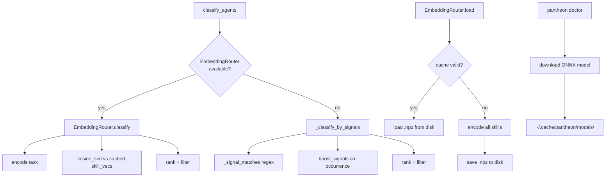

# Design: Embedding-Based Agent Routing

**Status:** Proposal
**Phase:** 6C — Pantheon Backlog
**Author:** Athena (architecture) + Eris (stress-test)
**Date:** 2026-03-29

---

## 1. Problem Statement

`classify_agents()` in `src/pantheon/skill.py:212-269` routes tasks to specialist agents by counting regex boundary matches of `routing_signals` keywords against the task string. The current implementation:

```python
score = sum(1 for s in signals if _signal_matches(s.lower(), task_lower))
```

Where `_signal_matches` (line 200) uses `re.search` with `\b` or lookaround boundaries.

### Current Limitations

| # | Limitation | Example | Impact |
|---|-----------|---------|--------|
| 1 | **No synonym awareness** | "auth middleware" → no match for signal "security" | Silent misroute — task falls to Demeter |
| 2 | **No contextual disambiguation** | "pipeline" matches mokosh (CI/CD) when user means data pipeline (seshat) | Requires `boost_signals` workaround (line 254-268) |
| 3 | **No paraphrase handling** | "make the API faster" → no match for "performance" | Requires exhaustive signal enumeration |
| 4 | **Linear signal scaling** | Each new synonym/paraphrase = manual SKILL.md edit | O(specialists × signals) maintenance burden |
| 5 | **Integer scoring granularity** | Scores are raw counts — a 3-signal match and a 3-signal match look equal even when one is semantically stronger | No confidence gradient between matches |

### What's Working

The regex router is fast (<1ms), zero-dependency, deterministic, and well-tested (14 tests in `test_skill.py`). The `boost_signals` mechanism (line 254-268) handles co-occurrence disambiguation. These are strengths to preserve.

---

## 2. Constraints

- **Python ≥3.10** — per `pyproject.toml` requires-python
- **Zero required dependencies** — core package depends only on pyyaml, requests, rich
- **Interactive latency** — routing runs on every user message; budget is <50ms
- **No GPU required** — must run on CPU-only developer machines
- **Backward compatibility** — `classify_agents()` signature and return semantics must be preserved
- **Test coverage ≥80%** — per pytest `--cov-fail-under=80`

---

## 3. Proposed Architecture

### 3.1 Two-Tier Routing

```
                         ┌─────────────────────┐
                         │   classify_agents()  │  ← existing public API
                         │   (unified entry)    │
                         └──────────┬───────────┘
                                    │
                          ┌─────────▼──────────┐
                          │ EmbeddingRouter     │
                          │ available?          │
                          └─────┬─────────┬────┘
                            yes │         │ no
                     ┌──────────▼───┐  ┌──▼──────────────┐
                     │  Semantic     │  │  Signal-match    │
                     │  similarity   │  │  (current regex) │
                     │  scoring      │  │  fallback        │
                     └──────────────┘  └─────────────────┘
```

The public `classify_agents()` function retains its current signature. Internally, it attempts semantic scoring first and falls back to signal matching when the embedding model is unavailable.

### 3.2 Embedding Model Selection

| Model | Dims | Size | Latency (CPU) | PyTorch? | Notes |
|-------|------|------|---------------|----------|-------|
| `all-MiniLM-L6-v2` | 384 | 80MB | ~5ms/query | Yes (via sentence-transformers) | Widely used, good short-text quality |
| `all-MiniLM-L6-v2` (ONNX) | 384 | 80MB | ~3ms/query | No | Via `optimum` or raw `onnxruntime` |
| `bge-small-en-v1.5` | 384 | 130MB | ~8ms/query | Yes | Better on retrieval benchmarks |
| `nomic-embed-text-v1.5` | 768 | 270MB | ~12ms/query | Yes | Best quality, largest footprint |

**Recommendation:** `all-MiniLM-L6-v2` via ONNX Runtime.

Rationale: `sentence-transformers` pulls in PyTorch (~2GB installed), which is unacceptable for a CLI tool's optional feature. ONNX Runtime is ~40MB and provides identical inference quality with lower latency. The model weights themselves are ~80MB either way.

### 3.3 Skill Embedding Strategy

Each skill's semantic identity is composed from multiple text fields:

```python
skill_text = f"{skill.name}: {skill.description}. Keywords: {', '.join(skill.routing_signals)}"
```

Embeddings are computed once per skill set and cached to disk. Cache invalidation uses a content hash of the concatenated skill texts.

```python
@dataclass
class EmbeddingRouter:
    """Semantic similarity router with disk-cached skill embeddings."""

    _model: Any  # onnxruntime InferenceSession or SentenceTransformer
    _skill_vecs: dict[str, np.ndarray]
    _cache_path: Path

    @classmethod
    def load(
        cls,
        skills: dict[str, Skill],
        cache_dir: Path = Path(".cache/pantheon"),
        model_name: str = "all-MiniLM-L6-v2",
    ) -> EmbeddingRouter:
        """Build or load cached router. Raises ImportError if deps missing."""
        ...

    def classify(
        self,
        task: str,
        *,
        top_n: int = 3,
        min_confidence: float = 0.0,
    ) -> list[tuple[str, float]]:
        """Return (agent_name, similarity_score) pairs, highest first."""
        task_vec = self._encode(task)
        scores = {
            name: float(self._cosine(task_vec, skill_vec))
            for name, skill_vec in self._skill_vecs.items()
        }
        ranked = sorted(scores.items(), key=lambda x: x[1], reverse=True)
        if min_confidence > 0:
            ranked = [(n, s) for n, s in ranked if s >= min_confidence]
        return ranked[:top_n]
```

### 3.4 Hybrid Scoring (Phase 2)

Combine signal match precision with embedding recall:

```python
# Normalize signal score to [0, 1]
signal_norm = signal_match_count / max(len(skill.routing_signals), 1)

# Embedding score is already [0, 1] (cosine similarity)
embed_score = cosine_similarity(task_vec, skill_vec)

# Weighted blend — signal matches are high-precision, embeddings are high-recall
final_score = (0.3 * signal_norm) + (0.7 * embed_score)
```

**Decision:** Start with pure embedding scoring in Phase 1. If routing accuracy tests show regressions where signal matching outperforms (exact keyword tasks), introduce hybrid scoring as Phase 2. Do not pre-build hybrid scoring speculatively.

### 3.5 Integration into `classify_agents()`

```python
# In skill.py — updated classify_agents()

_embedding_router: EmbeddingRouter | None = None
_embedding_init_failed: bool = False

def classify_agents(
    task: str,
    skills: dict[str, Skill],
    *,
    min_confidence: float = 0.0,
    top_n: int = 3,
) -> list[tuple[str, int | float]]:
    global _embedding_router, _embedding_init_failed

    if not _embedding_init_failed and _embedding_router is None:
        try:
            _embedding_router = EmbeddingRouter.load(skills)
        except (ImportError, Exception):
            _embedding_init_failed = True

    if _embedding_router is not None:
        results = _embedding_router.classify(task, top_n=top_n, min_confidence=min_confidence)
        # Preserve Demeter-removal semantics
        non_demeter = [(n, s) for n, s in results if n != "demeter"]
        return non_demeter if non_demeter else results

    # Fallback: current signal-matching logic (unchanged)
    return _classify_by_signals(task, skills, min_confidence=min_confidence, top_n=top_n)
```

Key decisions:
- **Lazy initialization** — model loads on first `classify_agents()` call, not at import
- **Fail-once** — if loading fails, `_embedding_init_failed` prevents repeated attempts
- **Module-level singleton** — one model instance shared across calls (the model is stateless and thread-safe)
- **Demeter removal** — preserved from current logic

### 3.6 Dependency Strategy

```toml
# pyproject.toml
[project.optional-dependencies]
embeddings = ["onnxruntime>=1.17", "tokenizers>=0.15", "numpy>=1.26"]
```

Installation: `pip install pantheon[embeddings]`

The ONNX approach avoids the PyTorch dependency entirely. Total install size: ~120MB (onnxruntime ~40MB + model weights ~80MB) vs ~2.1GB with sentence-transformers + PyTorch.

### 3.7 Model Acquisition

The ONNX model file must be downloaded on first use. Strategy:

1. Check `~/.cache/pantheon/models/all-MiniLM-L6-v2/model.onnx`
2. If missing, download from Hugging Face Hub (ONNX export is pre-built for this model)
3. Provide `pantheon doctor --check-embeddings` to pre-download and validate

No auto-download during routing — if model isn't cached, fall back to signal matching. Download is explicit via CLI command.

---

## 4. Component Map



---

## 5. Evaluation Plan

### 5.1 Routing Accuracy Test Suite

Build ground-truth test cases covering the limitations identified in §1:

```python
ROUTING_EVAL = [
    # Exact signal match (should pass for both routers)
    ("review security vulnerabilities", ["kali"]),
    ("write a CI/CD pipeline YAML", ["mokosh"]),
    ("analyze these access logs", ["seshat"]),

    # Synonym/paraphrase (signal router fails, embedding should pass)
    ("harden the auth middleware", ["kali"]),
    ("make the API respond faster", ["pele"]),  # performance → ops
    ("check this code for race conditions", ["brigid", "kali"]),  # concurrency → Go + security

    # Disambiguation (signal router misroutes)
    ("build a data pipeline for ETL", ["seshat"]),        # not mokosh
    ("create a GitHub Actions workflow", ["mokosh"]),      # not seshat
    ("GPU memory leak in CUDA kernel", ["oya"]),           # not generic

    # Multi-specialist (both routers should return multiple)
    ("security audit the Kubernetes deployment", ["kali", "pele"]),
    ("review this Python test for coverage gaps", ["themis", "nuwa"]),

    # Edge cases
    ("fix a typo in the readme", []),                      # no specialist
    ("help", []),                                          # no specialist
    ("explain how the router works", ["athena"]),          # meta-question
]
```

### 5.2 Metrics

- **Precision@1** — is the top-ranked agent correct?
- **Recall@3** — are all expected agents in the top 3?
- **Mean Reciprocal Rank** — where does the correct agent appear in the ranking?
- **Fallback rate** — how often does embedding routing fail and fall back to signals?

### 5.3 Acceptance Criteria

| Metric | Signal baseline | Embedding target |
|--------|----------------|-----------------|
| Precision@1 | Measure current | ≥ current |
| Recall@3 (synonym cases) | ~0% (by definition) | ≥ 70% |
| Latency p95 | <1ms | <50ms |
| Fallback rate | N/A | <5% (when deps installed) |

---

## 6. What Could Go Wrong

*Athena's risk analysis:*

### 6.1 Model Download on First Use (Medium)
`onnxruntime` is a pip install, but the ONNX model weights (~80MB) must be downloaded separately. If the user hasn't run `pantheon doctor --check-embeddings`, the first routing attempt will fall back to signals silently.

**Mitigation:** Log a one-time INFO message: "Embedding model not found. Run `pantheon doctor --check-embeddings` for semantic routing. Using signal-based fallback."

### 6.2 Startup Latency (Medium)
Loading the ONNX model and deserializing cached embeddings adds 200-500ms on first call.

**Mitigation:** Lazy init (already designed in §3.5). The cost is paid once per process lifetime, on the first routing call. Subsequent calls use the cached model.

### 6.3 Embedding Drift / Cache Staleness (Low)
If SKILL.md files are edited, cached embeddings become stale.

**Mitigation:** Hash the concatenation of all skill texts. Store the hash alongside the `.npz` cache. On load, recompute hash and invalidate if changed. Cost of recomputation: ~200ms for 24 skills.

### 6.4 Short Query Ambiguity (Medium)
Very short queries ("fix bug", "help") produce embeddings that are equidistant from all skills, yielding low-confidence, arbitrary rankings.

**Mitigation:** When the top embedding score is below a threshold (e.g., 0.3), fall back to signal matching. If signals also produce no matches, return empty (current behavior for unroutable tasks).

### 6.5 Over-Routing / False Positives (High)
Semantic similarity surfaces plausible-but-wrong specialists. "Write a poem about Python" could route to nuwa (Python code) instead of calliope (creative text) because "Python" is semantically close to nuwa's description.

**Mitigation:**
- Minimum confidence threshold (configurable, default 0.3)
- Negative signals: add an optional `exclude_signals` field to SKILL.md metadata that penalizes score when present ("poem", "creative writing" as excludes for nuwa)
- The hybrid scoring approach (§3.4) helps — signal matching would correctly give nuwa a 0 for "write a poem"

### 6.6 ONNX Runtime Platform Compatibility (Low)
`onnxruntime` ships pre-built wheels for Linux x86_64, macOS (ARM + Intel), and Windows. Less common platforms (Alpine musl, ARM Linux) may lack wheels.

**Mitigation:** Fall back to signal matching. The optional dependency is already a soft requirement.

---

## 7. Eris Challenge — Assumptions Stress-Tested

### Assumptions Challenged

**1. "Embeddings are better than keywords for routing."**
Not universally. For tasks that exactly name the domain ("review security"), keyword matching is 100% precise with zero latency. Embeddings add value only for synonyms and paraphrases. If 80% of real user tasks use explicit domain language, the embedding router adds complexity for the 20% tail.

*Verdict:* Test with real usage data before committing. The eval suite (§5) must include a representative mix, not just the hard cases that motivate embeddings.

**2. "all-MiniLM-L6-v2 is sufficient for routing quality."**
This model was trained on general NLI/STS data, not on software engineering task descriptions. "CUDA kernel" and "GPU shader" may not be as semantically close as a domain expert expects. The model has no knowledge of the Pantheon's specialist roster.

*Verdict:* Run the eval suite before selecting the final model. Consider fine-tuning on a synthetic dataset of (task, specialist) pairs if off-the-shelf quality disappoints.

**3. "The fallback is seamless."**
The signal router returns `list[tuple[str, int]]` (integer scores). The embedding router returns `list[tuple[str, float]]` (cosine similarities in [0,1]). Callers that inspect score values (not just rankings) will break. The `min_confidence` parameter changes meaning: currently it's a signal count threshold, under embeddings it's a similarity threshold.

*Verdict:* This is a **breaking semantic change** disguised as backward compatibility. Options:
  - (a) Normalize both to [0, 1] floats — breaking change, bump minor version
  - (b) Return only rankings, drop score from return type — API change
  - (c) Keep int scores for signal fallback, float for embeddings — caller must handle both → fragile
  - **Recommend (a)** with a deprecation warning in 0.2.x and type change in 0.3.0

### Questions Raised

1. **What's the actual distribution of user tasks?** Are they mostly keyword-explicit ("review Go code") or paraphrase-heavy ("make this faster")? Without telemetry, we're designing for an assumed distribution.

2. **What happens when two specialists have near-identical embeddings?** nuwa ("Python code, data science") and seshat ("data analysis, SQL") overlap heavily in embedding space. Is cosine similarity granular enough to disambiguate, or do we need the boost_signals mechanism even with embeddings?

3. **Is the ~80MB model download acceptable for a CLI tool?** The current `pip install pantheon` is <1MB. Adding `pantheon[embeddings]` makes it 120MB+. Users in CI environments with cold caches pay this on every run.

4. **Who owns the model lifecycle?** When Hugging Face updates the model or changes the ONNX export format, who notices? Who updates the pinned version?

5. **Can we get 80% of the benefit with 10% of the complexity?** Instead of embeddings, could we expand signal matching with a lightweight synonym table (hand-curated, <100 entries)? e.g., `"auth" → "security"`, `"perf" → "performance"`. This is boring but has zero dependencies and zero latency.

### Alternatives Suggested

**Alternative: Synonym expansion table instead of embeddings.**
Maintain a `_SYNONYMS: dict[str, list[str]]` mapping in `skill.py`. Before signal matching, expand the task text by appending synonym expansions. This captures the top 20 misrouted terms with zero new dependencies.

*Trade-off:* Manual maintenance, won't handle novel paraphrases. But it's shippable in a single PR, testable with the same eval suite, and sets a performance baseline that embeddings must beat to justify their complexity.

**Recommendation:** Build the synonym table first (Phase 6C-alpha). Run the eval suite. Then implement embeddings (Phase 6C-beta) and compare. Ship whichever scores better on the eval suite. If embeddings win, keep the synonym table as the fallback for when embeddings are unavailable.

### Scaling Risks

- **24 skills × 384 dims = 9,216 floats** — trivial memory footprint now. At 100 skills, still only ~150KB. No scaling concern for skill embeddings.
- **ONNX model loading** — constant cost regardless of skill count. ~200ms cold, ~0ms warm.
- **Cache invalidation at scale** — with 100+ skills, hashing all skill texts takes ~1ms. Acceptable.
- **Concurrent routing** — ONNX Runtime inference is thread-safe. No mutex needed. But the lazy init pattern (§3.5) has a TOCTOU race: two threads could both see `_embedding_router is None` and both attempt to load the model. Use `threading.Lock` around init.

---

## 8. Implementation Plan

### Phase 6C-alpha — Synonym Expansion (no new dependencies)

1. Add `_SYNONYMS` table to `skill.py`
2. Expand task text before signal matching in `_classify_by_signals()`
3. Add eval test cases from §5.1
4. Measure baseline Precision@1 and Recall@3

### Phase 6C-beta — Embedding Router (optional dependency)

1. Add `embeddings` optional dependency to `pyproject.toml`
2. Create `src/pantheon/embed_router.py` — `EmbeddingRouter` class
3. Integrate into `classify_agents()` with fallback
4. Add `pantheon doctor --check-embeddings` command
5. Run eval suite, compare to synonym baseline

### Phase 6C-gamma — Hybrid Scoring (if needed)

1. Implement weighted blend from §3.4
2. Only if pure embedding scoring regresses on exact-keyword tasks
3. Tune weights on eval suite

---

## 9. Decision

**Ship Phase 6C-alpha first** (synonym table). It's zero-dependency, solves the top pain points, and establishes the eval baseline. Then build Phase 6C-beta (embedding router) behind the `pantheon[embeddings]` optional extra. Compare on the eval suite. The embedding router must beat the synonym-enhanced signal router on Recall@3 by ≥15 percentage points to justify its complexity.

The signal router with synonym expansion remains the permanent zero-dependency fallback. The embedding router is an upgrade path for users who want semantic routing and accept the ~120MB dependency footprint.

**Score type:** Normalize to `float` in [0, 1] for both backends (Eris's challenge §7, point 3). Deprecate integer score semantics in 0.2.x, remove in 0.3.0.

**Threading:** Guard lazy init with `threading.Lock` (Eris's scaling risk).

**Model:** `all-MiniLM-L6-v2` via ONNX Runtime. Re-evaluate after eval suite results.
